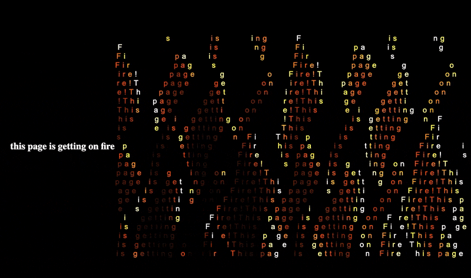

# Text Animation Web Page
(this page is on fire)

## Overview

This web project is meant to pimp up a web page. It utilizes HTML, CSS, and JavaScript to create a dynamic text animation with varying colors, sizes, and spacing. The animation is designed to run in a web browser.



## Features

- Dynamic text animation mimicking the effect of the original Processing sketch.
- Customizable text content, color mapping, font size, and letter spacing.
- Responsive design for optimal viewing on different devices.

## Getting Started

### Prerequisites

- Web browser (Google Chrome, Mozilla Firefox, Safari, etc.)

### Installation

1. Clone the repository:

   ```bash
   git clone https://github.com/your-username/your-repo.git

2. Open index.html

Open the index.html file in your preferred web browser, or just hit "GO Live" in VSCode

Usage
The animation will start automatically upon opening the index.html file in a web browser. The text content, color, size, and spacing are dynamically animated based on the defined logic in the JavaScript file (script.js).

Customization
Text Content: Modify the str1 variable in script.js to change the text being animated.
Animation Logic: Adjust the mapping functions and mathematical operations in script.js to customize the animation effects.
Styling: Modify the CSS in styles.css to change the appearance of the text elements.
Contributing
Contributions are welcome! If you have any ideas for improvements or new features, feel free to submit issues or pull requests.

License
This project is licensed under the MIT License.

Acknowledgements
This project was inspired by a Processing sketch.
The idea and initial structure were based on [initial repository/source if applicable].
Contact
For any inquiries or feedback, feel free to reach out via [email address or other contact information].

